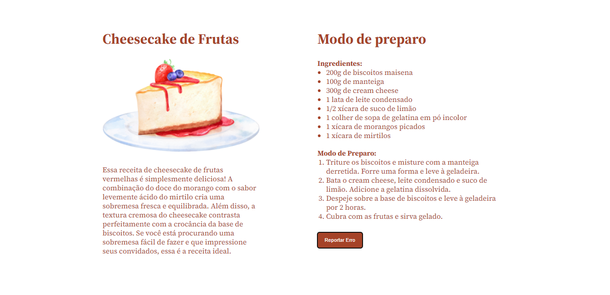

<h1 align="center"> Cheesecake Page </h1>

  <a href="#technologies">Technologies</a>&nbsp;&nbsp;&nbsp;|&nbsp;&nbsp;&nbsp;
  <a href="#project">Project</a>&nbsp;&nbsp;&nbsp;|&nbsp;&nbsp;&nbsp;
  <a href="#how-to-use">How to Use</a>&nbsp;&nbsp;&nbsp;|&nbsp;&nbsp;&nbsp;
  <a href="#license">License</a>&nbsp;&nbsp;&nbsp;|&nbsp;&nbsp;&nbsp;
  <a href="#readme-in-portuguese">README in Portuguese</a>

  

 
  
  

## Technologies

- HTML
- CSS
- Git and GitHub
- Figma

## Project

This project consists of a web page that presents a recipe for red fruit cheesecake. The page provides information about the necessary ingredients and the step-by-step preparation method. Additionally, it includes an image of the cheesecake to give a visual idea of the dessert.

This website is responsive and has been developed following the "mobile-first" strategy, ensuring an optimized user experience on mobile devices as a priority.
## How to Use

To access the finished project, [click here](https://fernandoalvesrufino.github.io/cheesecake_page/).

## License

This project is licensed under the MIT License.

by Fernando Rufino

`Project created by Rocketseat`

 

## README in Portuguese

<h1 align="center"> Favoritos GitHub </h1>

  <a href="#tecnologias">Tecnologias</a>&nbsp;&nbsp;&nbsp;|&nbsp;&nbsp;&nbsp;
  <a href="#projeto">Projeto</a>&nbsp;&nbsp;&nbsp;|&nbsp;&nbsp;&nbsp;
  <a href="#como-usar">Como Usar</a>&nbsp;&nbsp;&nbsp;|&nbsp;&nbsp;&nbsp;
  <a href="#licença">Licença</a>

  

 
  
  

## Tecnologias

- HTML
- CSS
- Git e GitHub
- Figma

## Projeto

Este projeto consiste em uma página da web que apresenta uma receita de cheesecake de frutas vermelhas. A página fornece informações sobre os ingredientes necessários e o passo a passo do modo de preparo. Além disso, inclui uma imagem do cheesecake para dar uma ideia visual da sobremesa.

Este site é responsivo e foi desenvolvido seguindo a estratégia "mobile-first", garantindo uma experiência de usuário otimizada em dispositivos móveis como prioridade.
## Como Usar

- Para acessar ao projeto finalizado, [clique aqui](https://fernandoalvesrufino.github.io/cheesecake_page/).

## Licença

Esse projeto está sob a licença MIT.

by Fernando Rufino

`Projeto criado pela Rocketseat`